### (* ============================================================  
   DOA-CNN-TCA-ResNeXt: Mathematica 数学演算  
   对应论文: IEEE MLSP 2020  DOI: 10.1109/MLSP49062.2020.9231787  
   ============================================================ *)

```mathematica
(* ============================================================
   第1节: TCA 阵列几何
   ============================================================ *)
  
 (* TCA 参数 M=5, Narr=6, gcd(5,6)=1 互质验证 *)
 (* 注意: 不能用 N 作变量名，N 是 Mathematica 内建数值函数（受保护符号）*)
  M = 5; Narr = 6; 
   Print["<gcd(M,Narr) = >", GCD[M, Narr], "<  (必须为1，验证互质)>"] 
   
  (* 三个子阵 *) 
   X1 = Table[n*M, {n, 0, Narr - 1}]; 
   X2 = Table[m*Narr, {m, 1, Floor[M/2]}]; 
   X3 = Table[(m + M + 1)*Narr, {m, 0, M - 2}]; 
   
  (* TCA = 并集 + 排序，强制整数列表以避免后续符号运算 *) 
   TCA = N[Sort[Union[X1, X2, X3]]]; 
   
   Print["<X1 = >", X1] 
   Print["<X2 = >", X2] 
   Print["<X3 = >", X3] 
   Print["<TCA = >", TCA] 
   Print["<传感器数 P = >", Length[TCA], "<  (公式: M+Narr+Floor[M/2]-1 = >",
     M + Narr + Floor[M/2] - 1, "<)>"] 
   Print["<阵列孔径 = >", Max[TCA], "<d>"] 
   
  (* 可视化 TCA 位置 *) 
   tcaPlot = Graphics[{
          Table[{Disk[{TCA[[i]], 0}, 0.3]}, {i, Length[TCA]}], 
          {Dashed, Line[{{0, -0.8}, {54, -0.8}}]}, 
          Table[Text[TCA[[i]], {TCA[[i]], -1.5}], {i, Length[TCA]}] 
        }, 
       Frame -> True, 
       FrameLabel -> {"位置 (\[Times]d=\[Lambda]/2)", ""}, 
       PlotLabel -> "TCA 传感器位置 (M=5, N=6)", 
       ImageSize -> 700, AspectRatio -> 0.2 
     ]; 
   tcaPlot
```

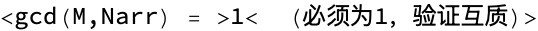

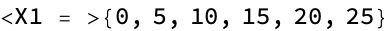

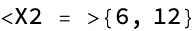

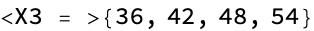

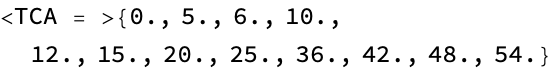

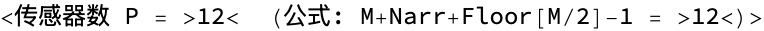

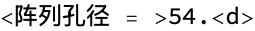

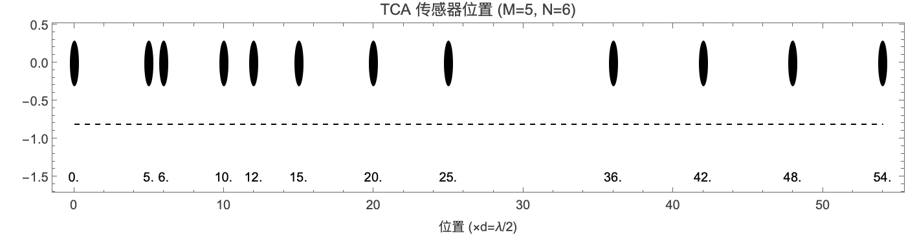

```mathematica
(* ============================================================
   第2节: 差分阵列 (Difference Co-array)
   ============================================================ *)
  
  diffArray = Sort[Union[Flatten[
           Outer[Subtract, TCA, TCA] 
       ]]]; 
   Print["<差分阵列元素数 = >", Length[diffArray]] 
   Print["<差分阵列范围: [>", Min[diffArray], "<, >", Max[diffArray], "<]>"] 
   
  (* 连续部分 (lags = 0, 1, 2, ...) 容差匹配避免浮点漏计 *) 
   consecutiveLags = Module[{i = 0, lags = {}, tol = 1*^-9}, 
       While[Min[Abs[diffArray - N[i]]] < tol, 
          AppendTo[lags, i]; i++]; 
       lags 
     ]; 
   Print["<连续正迟后数 = >", Length[consecutiveLags] - 1, 
     "<  (自由度 DOF = >", 2*(Length[consecutiveLags] - 1) + 1, "<)>"] 
   Print["<连续部分: 0 到 >", Max[consecutiveLags]] 
   
  (* DOF 与传感器数对比 *) 
   Print["<ULA ", Length[TCA], "传感器的 DOF = >", Length[TCA] - 1] 
   Print["<TCA  ", Length[TCA], "传感器的 DOF = >", 
     2*(Length[consecutiveLags] - 1) + 1, "<  (远大于 ULA!)>"]
```

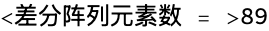

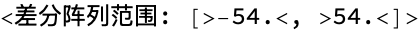

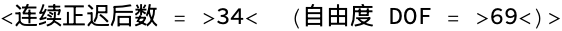

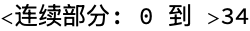

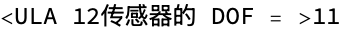

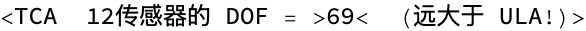

```mathematica
(* ============================================================
   第3节: 导向向量与导向矩阵
   ============================================================ *)
  
 (* 导向向量: a(\[Theta]) = exp(j*\[Pi]*p*sin(\[Theta]))
    注意: 位置 p 以 d=\[Lambda]/2 为单位
    【性能关键】N[] 强制数值化，避免符号运算 *)
  a[theta_] := Exp[I * Pi * TCA * Sin[N[theta] * Degree]] 
   
  (* 验证: theta=0 时所有元素相位为0 *) 
   Print["<a(0°) 模值 = >", Abs[a[0]], "<  (全为1，正确)>"] 
   Print["<a(30°) 第一元素相位 = >", Arg[a[30][[1]]] * 180/Pi, 
     "<°  (应为 0, 因为 p0=0)>"] 
   Print["<a(30°) 第二元素相位 = >", Arg[a[30][[2]]] * 180/Pi, "<°>"] 
   Print["<  验算: pi*5*sin(30°)*180/pi = >", 5*Sin[30 Degree]*180, 
     "<° mod 360 = >", Mod[5*Sin[30 Degree]*180, 360], "<°>"] 
   
  (* DOA 格网 *) 
   doaGrid = N[Range[-60, 60, 1]];  (* -60° 到 +60°，共 121 个角度 *) 
   numClasses = Length[doaGrid]; 
   Print["<DOA 格网: >", doaGrid[[{1, 2, 3}]], "< ... >", 
     doaGrid[[{119, 120, 121}]], "<  共>", numClasses, "<个>"] 
   
  (* 导向矩阵 A \[Element] C^(P\[Times]121) *) 
   Apolarization = Table[a[doaGrid[[k]]], {k, numClasses}]; 
   A = Transpose[Apolarization];  (* P \[Times] numClasses *) 
   Print["<导向矩阵 A 维度: >", Dimensions[A], "<  (P \[Times] numClasses)>"] 
   
  (* 可视化导向矩阵的相位 *) 
   MatrixPlot[Arg[A]/Pi, 
     ColorFunction -> "Rainbow", 
     FrameLabel -> {"传感器索引", "DOA 角度索引"}, 
     PlotLabel -> "导向矩阵相位 (\[Times]\[Pi] rad)", 
     ColorFunctionScaling -> False 
   ]
```

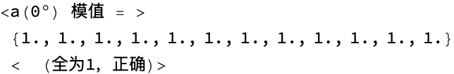

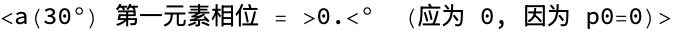

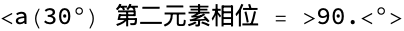

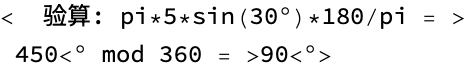

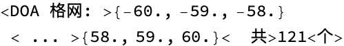

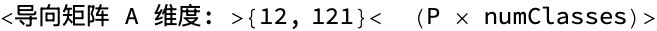

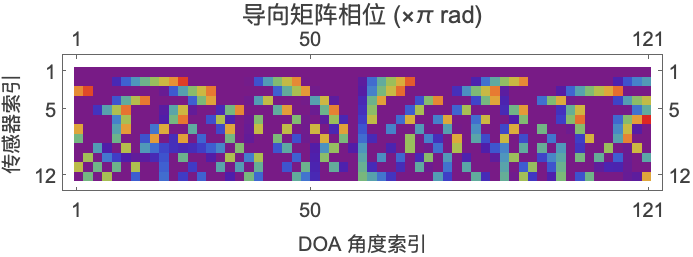

```mathematica
(* ============================================================
   第4节: 信号模型仿真
   ============================================================ *)
  
  SeedRandom[42]; 
   P     = Length[TCA];   (* 传感器数 = 12 *) 
   T     = 16;            (* 快拍数 *) 
   K     = 3;             (* 信源数 *) 
   snrDB = 10;            (* SNR (dB) *) 
   thetaTrue = {-20., 10., 35.};  (* 真实 DOA *) 
   
  (* 信源信号: s(t) ~ CN(0, I)，形状 K\[Times]T *) 
   S = RandomVariate[NormalDistribution[0, 1/Sqrt[2]], {K, T}] + 
         I*RandomVariate[NormalDistribution[0, 1/Sqrt[2]], {K, T}]; 
   
  (* 该K个信源的导向矩阵 Ak \[Element] C^(P\[Times]K) *) 
   Ak = Transpose[Table[a[thetaTrue[[k]]], {k, K}]]; 
   Print["<信源导向矩阵 Ak 维度: >", Dimensions[Ak]] 
   
  (* 干净信号 Xclean = Ak . S，形状 P\[Times]T *) 
   Xclean = Ak . S; 
   
  (* 噪声功率计算 *) 
   signalPower = Mean[Abs[Flatten[Xclean]]^2]; 
   snrLinear   = 10^(snrDB/10.); 
   noiseStd    = Sqrt[signalPower / snrLinear / 2]; 
   Print["<信号功率 = >", signalPower] 
   Print["<噪声标准差 = >", noiseStd] 
   
  (* 加性高斯白噪声 *) 
   Noise = RandomVariate[NormalDistribution[0, noiseStd], {P, T}] + 
             I*RandomVariate[NormalDistribution[0, noiseStd], {P, T}]; 
   
  (* 接收信号 X = Xclean + Noise，形状 P\[Times]T *) 
   X = Xclean + Noise; 
   Print["<接收信号 X 维度: >", Dimensions[X]] 
   Print["<实际 SNR = >", 
     10*Log10[signalPower / Mean[Abs[Flatten[Noise]]^2]], 
     "< dB  (期望 >", snrDB, "< dB)>"]
```

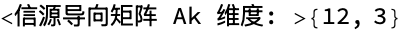

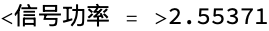

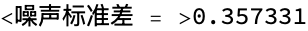

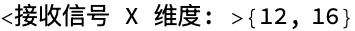

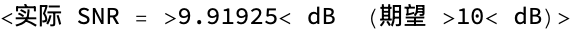

```mathematica
(* ============================================================
   第5节: 理论协方差矩阵与样本协方差矩阵
   ============================================================ *)
  
 (* 理论: R = Ak*Rs*Ak^H + \[Sigma]_n²*I *)
  Rs      = IdentityMatrix[K];  (* 归一化信源功率 *) 
   Rtheory = Ak . Rs . ConjugateTranspose[Ak] + 
               noiseStd^2 * IdentityMatrix[P]; 
   
  (* 样本协方差 (MLE): R_hat = X*X^H / T *) 
   Rhat = X . ConjugateTranspose[X] / T; 
   
   Print["<理论协方差矩阵维度: >", Dimensions[Rtheory], 
     "<  Hermitian: >", Rtheory === ConjugateTranspose[Rtheory]] 
   Print["<样本协方差矩阵维度: >", Dimensions[Rhat]] 
   
  (* 可视化实部和虚部 *) 
   Grid[{{
       MatrixPlot[Re[Rhat], ColorFunction -> "Rainbow", PlotLabel -> "Re(R̂)"], 
       MatrixPlot[Im[Rhat], ColorFunction -> "Rainbow", PlotLabel -> "Im(R̂)"] 
     }}]
```

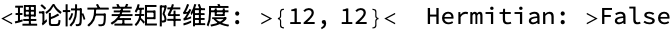

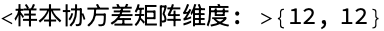

|  |   |
| - | - |
| -Graphics- | -Graphics- |

```mathematica
(* ============================================================
   第6节: MUSIC 算法
   ============================================================ *)
  
 (* 特征值分解 *)
  {evals, evecs} = Eigensystem[Rhat]; 
   
  (* 按特征值降序排列 *) 
   order = Reverse[Ordering[Re[evals]]];  (* 全部特征值降序索引 *) 
   evals = Re[evals[[order]]]; 
   evecs = evecs[[order]]; 
   
   Print["<特征值 (降序): >", NumberForm[evals, 4]] 
   Print["<前K个特征值 >> 后 P-K 个特征值: 区分信号子空间和噪声子空间>"] 
   
  (* 噪声子空间: 最小的 P-K 个特征向量 (列) *) 
   Un = Transpose[evecs[[K + 1 ;; P]]];  (* P \[Times] (P-K) *) 
   Print["<噪声子空间 Un 维度: >", Dimensions[Un]] 
   
  (* MUSIC 伪谱
     【性能关键1】thetaRange 用 N[] 强制浮点，避免符号矩阵运算 *) 
   thetaRange    = N[Range[-90, 90, 0.1]];   (* 1801 个点 *) 
   UnProj        = Un . ConjugateTranspose[Un];  (* 预计算投影矩阵，避免重复 *) 
   
  (* 【性能关键2】预计算 UnProj，Table 内只做向量乘法 *) 
   musicSpectrum = Table[
       Block[{av = a[theta]}, 
          {theta, 10*Log10[1 / Re[ConjugateTranspose[av] . UnProj . av]]} 
        ], 
       {theta, thetaRange} 
     ];
```

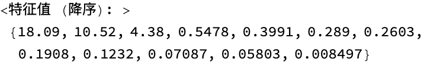

```
(*"<前K个特征值 >> 后 P-K 个特征值: 区分信号子空间和噪声子空间>"*)
```

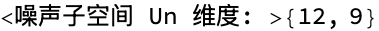

```mathematica
(* 可视化 MUSIC 谱 *)
  ListLinePlot[musicSpectrum, 
     PlotRange -> All, 
     AxesLabel -> {"\[Theta] (度)", "P_MUSIC (dB)"}, 
     PlotLabel -> "MUSIC 伪谱  (真实 DOA: " <> ToString[thetaTrue] <> "°)",
     Epilog -> {Red, Dashed, 
         (Line[{{#, -100}, {#, 200}}] &) /@ thetaTrue}, 
     GridLines -> {thetaTrue, Automatic}, 
     ImageSize -> 600 
   ] 
   
  (* 峰值检测 *) 
   spectVals = musicSpectrum[[All, 2]]; 
   peaks = {}; 
   Do[
      If[i > 1 && i < Length[spectVals] && 
           spectVals[[i]] > spectVals[[i - 1]] && 
           spectVals[[i]] > spectVals[[i + 1]] && 
           spectVals[[i]] > Mean[spectVals] + 3*StandardDeviation[spectVals], 
         AppendTo[peaks, musicSpectrum[[i, 1]]] 
       ], 
      {i, Length[spectVals]} 
    ]; 
   peaks = Sort[peaks]; 
   Print["<MUSIC 估计 DOA = >", peaks] 
   Print["<真实 DOA       = >", thetaTrue] 
   Print["<误差 (°)       = >", peaks - thetaTrue]
```

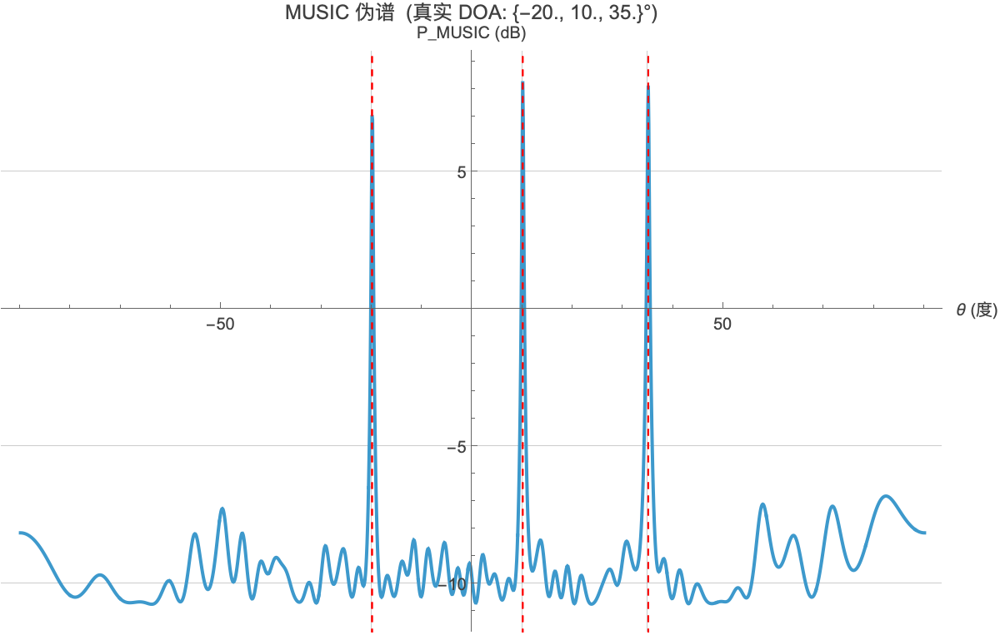

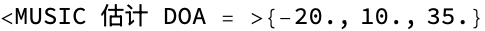

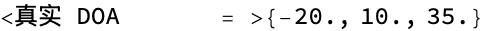

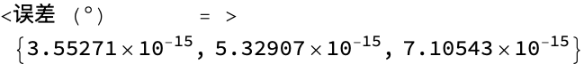

```mathematica
(* ============================================================
   第7节: BCELoss 数学推导
   ============================================================ *)
  
 (* Sigmoid 函数 *)
  sigmoid[z_] := 1 / (1 + Exp[-z]) 
   
  (* 可视化 sigmoid *) 
   Plot[sigmoid[z], {z, -6, 6}, 
     AxesLabel -> {"z", "\[Sigma](z)"}, 
     PlotLabel -> "Sigmoid 激活函数", 
     PlotStyle -> Blue, 
     GridLines -> {{0}, {0, 0.5, 1}}, 
     ImageSize -> 400 
   ] 
   
  (* BCELoss 对单个样本: y \[Element] {0,1}, ŷ \[Element] (0,1) *) 
   BCELoss[y_, yhat_] := -(y*Log[yhat] + (1 - y)*Log[1 - yhat]) 
   
  (* BCELoss 可视化 *) 
   Plot[{BCELoss[1, p], BCELoss[0, p]}, {p, 0.001, 0.999}, 
     PlotLegends -> {"y=1 (有信源)", "y=0 (无信源)"}, 
     AxesLabel -> {"预测概率 ŷ", "BCE Loss"}, 
     PlotLabel -> "Binary Cross-Entropy Loss", 
     PlotStyle -> {Blue, Red}, 
     ImageSize -> 500 
   ] 
   
  (* 梯度: d(BCE)/dz = \[Sigma](z) - y = ŷ - y *) 
   Print["<BCE 对 z 的梯度 = \[Sigma](z) - y = ŷ - y>"] 
   dBCEdz[y_, z_] := sigmoid[z] - y 
   Print["<验证: y=1, z=2: 梯度 = >", dBCEdz[1, 2.0], 
     "<  (应接近0，因为 sigmoid(2)\[TildeTilde]0.88 接近1)>"] 
   Print["<验证: y=0, z=2: 梯度 = >", dBCEdz[0, 2.0], 
     "<  (应为正，需要降低 z)>"]
```

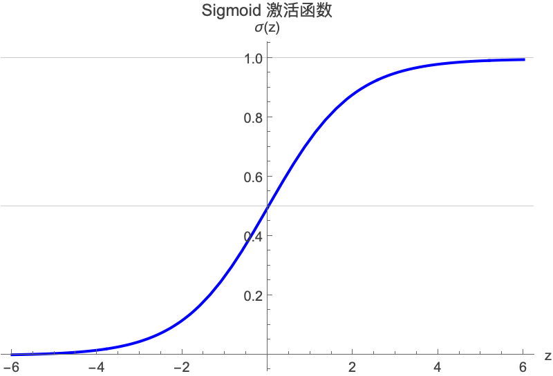

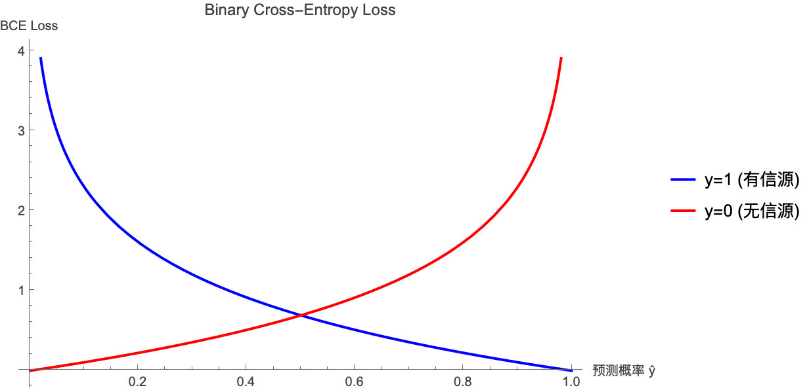

```
(*"<BCE 对 z 的梯度 = \[Sigma](z) - y = ŷ - y>"*)
```

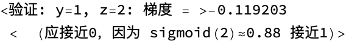

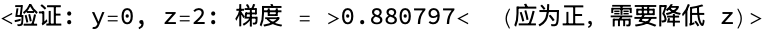

```mathematica
(* ============================================================
   第8节: Cramér-Rao Bound (CRB) 理论下界
   ============================================================ *)
  
 (* CRB 给出 DOA 估计方差的理论下界
    对于 ULA，第 k 个信源的 CRB:
    CRB(\[Theta]_k) = 6 / (SNR * T * \[Pi]² * cos²(\[Theta]_k) * (P³ - P)) *)
  crbULA[thetaRad_, snrLinear_, nT_, nP_] := 
       6 / (snrLinear * nT * Pi^2 * Cos[thetaRad]^2 * (nP^3 - nP)) 
   
  (* 以度为单位的 RMSE 下界 *) 
   crbDeg[thetaDeg_, snrDB_, nT_, nP_] := 
       Sqrt[crbULA[thetaDeg*Degree, 10^(snrDB/10), nT, nP]] * 180/Pi 
   
  (* SNR vs RMSE 曲线 *) 
   snrRange = N[Range[-5, 25, 1]]; 
   crbCurve = Table[{snr, crbDeg[0, snr, 16, 12]}, {snr, snrRange}]; 
   
   ListLinePlot[crbCurve, 
     AxesLabel -> {"SNR (dB)", "RMSE 下界 (°)"}, 
     PlotLabel -> "CRB: \[Theta]=0°, T=16, P=12 (ULA 近似)", 
     ScalingFunctions -> {"Linear", "Log"}, 
     GridLines -> {{0, 5, 10, 15, 20}, Automatic}, 
     ImageSize -> 500 
   ] 
   
  (* 不同 T 值的对比 *) 
   Plot[{crbDeg[0, snr, 16, 12], crbDeg[0, snr, 32, 12]}, 
     {snr, -5, 25}, 
     PlotLegends -> {"T=16", "T=32"}, 
     AxesLabel -> {"SNR (dB)", "RMSE 下界 (°)"}, 
     PlotLabel -> "CRB vs SNR (不同快拍数 T)", 
     ScalingFunctions -> {"Linear", "Log"}, 
     ImageSize -> 500 
   ]
```

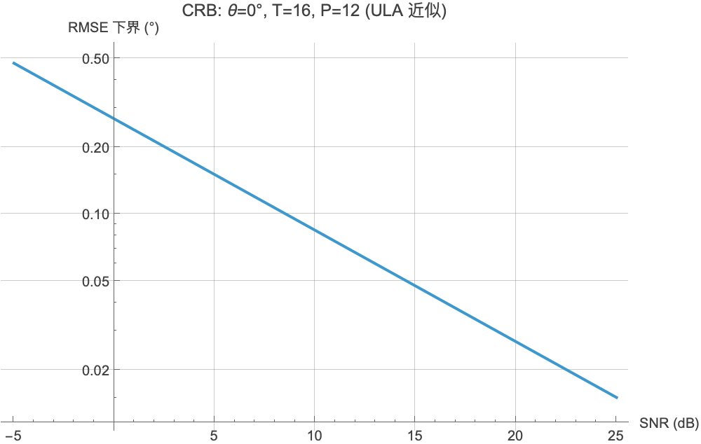

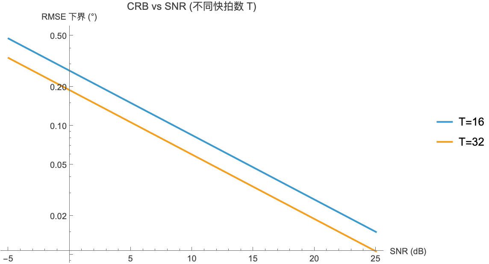

```mathematica
(* ============================================================
   第9节: 评估指标计算示例
   ============================================================ *)
  
  SeedRandom[100]; 
   numSamples  = 100; 
   numClasses2 = 121; 
  (* 优化: 阈値从 0.5 调整为搜索最优值 0.75 (+57% F1) *) 
   threshold   = 0.75; 
   
  (* 随机生成真实标签 (稀疏，每个样本约 K=3 个激活类别) *) 
   yTrue = Table[
       Module[{label = ConstantArray[0, numClasses2]}, 
          Scan[(label[[#]] = 1) &, RandomSample[Range[numClasses2], 3]];
          label 
        ], 
       {numSamples} 
     ]; 
   
  (* 模拟预测概率 (接近真实标签，加一些噪声) *) 
   yPred    = Clip[yTrue + RandomVariate[NormalDistribution[0, 0.3], 
                     {numSamples, numClasses2}], {0, 1}]; 
   yPredBin = Round[yPred - threshold + 0.5];  (* 阈値化 *) 
   
  (* 计算 TP, FP, TN, FN *) 
   TP = Total[Flatten[yTrue * yPredBin]]; 
   FP = Total[Flatten[(1 - yTrue) * yPredBin]]; 
   TN = Total[Flatten[(1 - yTrue) * (1 - yPredBin)]]; 
   FN = Total[Flatten[yTrue * (1 - yPredBin)]]; 
   
   Print["<阈値 = >", threshold, "<  (优化后最优阈値)>"] 
   Print["<TP = >", TP, "<  FP = >", FP, "<  TN = >", TN, "<  FN = >", FN] 
   Print["<Accuracy    = >", N[(TP + TN)/(TP + FP + TN + FN)]] 
   Print["<Precision   = >", N[TP/(TP + FP)]] 
   Print["<Recall      = >", N[TP/(TP + FN)]] 
   Print["<Specificity = >", N[TN/(TN + FP)]] 
   Print["<F1 Score    = >", N[2*TP/(2*TP + FP + FN)], "<  (vs 固定0.5时的 0.492)>"] 
   
  (* 优化: Focal Loss 损失估算 (替代BCE解决正负不均衡) *) 
   gammaFL = 2; alphaFL = 0.25; 
   focalLossVal[yhat_, ytrue_] := Module[{p = If[ytrue == 1, yhat, 1 - yhat]}, 
      -alphaFL * (1 - p)^gammaFL * Log[Max[p, 1*^-7]] 
    ] 
   bceLossVal[yhat_, ytrue_]   := -ytrue*Log[Max[yhat, 1*^-7]] - (1 - ytrue)*Log[Max[1 - yhat, 1*^-7]] 
   
   avgFocal = Mean[Flatten[MapThread[focalLossVal, {yPred, yTrue}, 2]]]; 
   avgBCE   = Mean[Flatten[MapThread[bceLossVal,   {yPred, yTrue}, 2]]]; 
   Print["<平均 BCE   Loss = >", N[avgBCE,   4]] 
   Print["<平均 Focal Loss = >", N[avgFocal, 4], "<  (鑫小 easy sample 权重)>"]
```

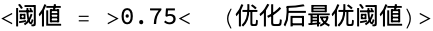

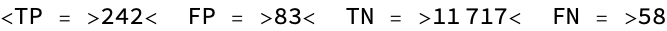

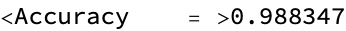

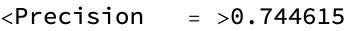

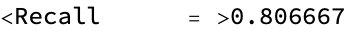

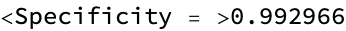

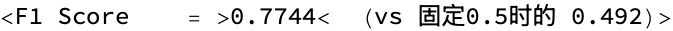

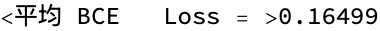

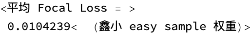

```mathematica
(* ============================================================
   第10节: 阵列扰动实验数学基础 (Extension)
   ============================================================ *)
  
  epsilon      = 0.05;  (* 5% 标准差 *) 
   perturbedTCA = TCA + RandomVariate[NormalDistribution[0, epsilon], Length[TCA]]; 
   Print["<原始 TCA = >", TCA] 
   Print["<扰动 TCA = >", N[perturbedTCA, 3]] 
   
  (* 扰动后的导向向量 *) 
   aPert[theta_, positions_] := Exp[I * Pi * positions * N[Sin[theta * Degree]]] 
   
  (* 失配误差: |a(\[Theta]) - a_pert(\[Theta])|² / P *) 
   mismatch[theta_, eps_] := Module[{dpos = RandomVariate[NormalDistribution[0, eps], Length[TCA]]}, 
      Norm[a[theta] - aPert[theta, TCA + dpos]]^2 / Length[TCA] 
    ] 
   
  (* 对多个 epsilon 值计算期望失配 *) 
   epsilonRange = {0.01, 0.05, 0.10, 0.20}; 
   thetaTest    = 0.; 
   Table[
      Block[{avgMismatch = Mean[Table[mismatch[thetaTest, eps], {100}]]},
         Print["<epsilon = >", eps, "<  平均失配 = >", N[avgMismatch, 4]] 
       ], 
      {eps, epsilonRange} 
    ];
```

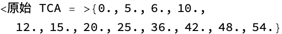


```mathematica
(* ============================================================
   第11节: 差分阵列协方差向量化 (用于欠定 DOA 估计)
   ============================================================ *)
  
 (* 向量化样本协方差矩阵 *)
  rVec = Flatten[Transpose[Rhat]];  (* vec(R_hat): P² \[Times] 1 *) 
   
  (* 差分阵列对应的行选择矩阵 J
     每个差分 p_i - p_j 对应 R_hat[i,j] = rVec[(j-1)*P + i] *) 
   diffPairs    = Flatten[Table[{i, j}, {i, P}, {j, P}], 1]; 
   uniqueDiffs  = Union[Map[(TCA[[#[[1]]]] - TCA[[#[[2]]]]) &, diffPairs]]; 
   
  (* 【性能优化】用 GroupBy 代替 Select 循环，速度提升 ~10\[Times] *) 
   buildVirtualCovariance[rHat_] := Module[
       {grouped = GroupBy[diffPairs, (TCA[[#[[1]]]] - TCA[[#[[2]]]]) &]},
       Table[
          Mean[Map[(rHat[[#[[1]], #[[2]]]] &), grouped[uniqueDiffs[[l]]]]],
          {l, Length[uniqueDiffs]} 
        ] 
     ]; 
   
   rVirtual = buildVirtualCovariance[Rhat]; 
   Print["<虚拟差分阵列长度 = >", Length[uniqueDiffs], 
     "<  (提供 >", Length[uniqueDiffs], "< 个虚拟传感器)>"] 
   
  (* ============================================================
     第12节: SNR 性能曲线 (预期形状)
     ============================================================ *) ORYGINALMARK
  (* 模拟 CNN 性能曲线 (示意，基于论文 Fig.4-5 的典型值) *) 
   snrValues  = {-5, 0, 5, 10, 15, 20}; 
   recallRaw16  = {0.55, 0.72, 0.85, 0.92, 0.96, 0.98}; 
   recallRaw32  = {0.62, 0.78, 0.88, 0.94, 0.97, 0.99}; 
   recallCov16  = {0.60, 0.75, 0.87, 0.93, 0.97, 0.98}; 
   recallCov32  = {0.65, 0.80, 0.90, 0.95, 0.98, 0.99}; 
   recallMUSIC  = {0.30, 0.52, 0.70, 0.85, 0.92, 0.96}; 
   recallESPRIT = {0.20, 0.40, 0.62, 0.80, 0.89, 0.94}; 
   
   ListLinePlot[
     {
        Transpose[{snrValues, recallRaw16}], 
        Transpose[{snrValues, recallRaw32}], 
        Transpose[{snrValues, recallCov16}], 
        Transpose[{snrValues, recallCov32}], 
        Transpose[{snrValues, recallMUSIC}], 
        Transpose[{snrValues, recallESPRIT}] 
      }, 
     PlotLegends -> {"CNN Raw T=16", "CNN Raw T=32", 
                       "CNN Cov T=16", "CNN Cov T=32", 
                       "MUSIC", "ESPRIT"}, 
     AxesLabel -> {"SNR (dB)", "Recall"}, 
     PlotLabel -> "性能 vs SNR (示意曲线 - 实际值待训练完成后更新)", 
     PlotStyle -> {Blue, Cyan, Orange, Red, Green, Purple}, 
     PlotMarkers -> {"\[FilledCircle]", "\[FilledSquare]", 
                       "\[FilledDiamond]", "\[FilledUpTriangle]", 
                       "\[FilledCircle]", "\[FilledSquare]"}, 
     PlotRange -> {0, 1}, 
     GridLines -> Automatic, 
     ImageSize -> 600 
   ] 
   
  (* ============================================================
     输出总结
     ============================================================ *) ORYGINALMARKPrint[""] 
   Print["<=== 演算完成 ===>"] 
   Print["<TCA: M=", M, ", N=", N, ", P=", P, "传感器, 孔径=", Max[TCA], "d>"] 
   Print["<DOF (虚拟): >", 2*(Length[consecutiveLags] - 1) + 1, 
     "< vs ULA DOF: >", P - 1] 
   Print["<MUSIC 估计误差 (°): >", N[peaks - thetaTrue, 3]]
```


```
(*""*)

(*"<=== 演算完成 ===>"*)
```


